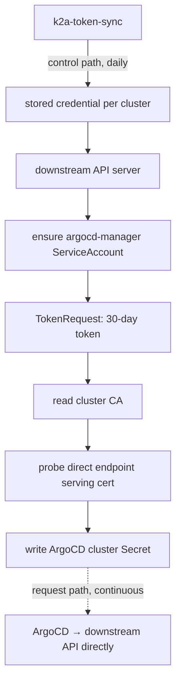

# k2a-token-sync

`k2a-token-sync` (**K**ubernetes-**to**-**A**rgoCD **Token Sync**) keeps ArgoCD's registrations for downstream
Kubernetes clusters valid, using short-lived ServiceAccount tokens it mints and rotates itself.

It replaces the permanent, non-expiring credential `argocd cluster add` leaves behind, without changing anything about
how ArgoCD connects.

## Why this is needed

Registering a cluster with ArgoCD means putting a credential for it in a Secret, and ArgoCD has no way to renew one. So
the credential has to be long-lived: a ServiceAccount token that never expires, or a client certificate that lasts a
year and then breaks every Application on that cluster at once.

A permanent cluster-admin token sitting at rest is also the pattern Kubernetes itself is retiring — the TokenRequest API
is the endorsed mechanism, auto-generated ServiceAccount token Secrets were removed in 1.24, and recent releases track
last-use on legacy tokens and clean up unused ones. And a credential with no expiry satisfies no rotation policy: it
cannot even be revoked selectively, since deleting the ServiceAccount is the only lever.

`k2a-token-sync` keeps each cluster registered with a **short-lived** ServiceAccount token that it mints and rotates
itself, from outside ArgoCD. Nothing about ArgoCD changes: it is the same `argocd-manager` identity and the same cluster
Secret format, so this replaces the credential half of `argocd cluster add` and leaves the rest alone.

## How it works

Two paths, and keeping them apart is the whole design:

- **Control path** — the daemon connects to each downstream cluster with its own narrowly-scoped credential to mint
  ArgoCD's token. It runs once a day.
- **Request path** — ArgoCD connects straight to the cluster's own endpoint with the credential the daemon published.

If the daemon is down, reconciliation pauses; ArgoCD keeps working. With the default 30-day token lifetime reissued at
half life, the daemon can be down for a fortnight before anything degrades.



Per cluster, each pass:

1. Connects with the credential provisioned for that cluster at bootstrap.
2. Ensures the `argocd-manager` ServiceAccount and its `cluster-admin` binding exist, creating them if absent. This is
   the same identity `argocd cluster add` installs.
3. Mints a bound token via the TokenRequest API, honouring whatever lifetime the API server grants.
4. Reads the cluster CA from the `kube-root-ca.crt` ConfigMap.
5. Probes the direct endpoint's TLS certificate, verifying it against that CA and checking the SANs cover the
   configured address.
6. Writes the ArgoCD cluster Secret. ArgoCD re-reads cluster Secrets on every reconcile, so credentials swap with no
   restart of any ArgoCD component.

A credential is only reissued once it is past half its lifetime, or when something has drifted — so routine passes
write nothing and do not churn ArgoCD's cluster cache.

### Certificate expiry

The daemon uses bearer tokens, so no client certificate expires. But the API server's **serving** certificate still
matters: once it expires, or if it never covered the endpoint, ArgoCD's TLS handshake fails no matter how fresh the
token is.

So the daemon **observes** it — probing the endpoint each pass, verifying the presented chain against the CA it
publishes as ArgoCD's `caData`, and reporting expiry in `/status` and in its logs. It warns from 90 days out by default.

It never rotates anything. Reissuing a serving certificate needs node access and restarts control-plane components, so
it belongs to whatever manages the cluster — worth automating with your existing configuration management, one
control-plane node at a time. The cluster CA is deliberately out of scope too: rotating it would invalidate every
kubeconfig and every ArgoCD `caData` at once.

## Prerequisites

- ArgoCD, and this daemon, running on a cluster that can reach each downstream API server directly.
- One-time bootstrap access per cluster, see [below](#one-time-bootstrap-per-cluster).

**Check the API server's certificate SANs first.** A serving certificate normally covers the node's own addresses,
`127.0.0.1`, `localhost` and the in-cluster names — but not a VIP, load balancer or FQDN unless that name was included
when the certificate was issued. If the endpoint you point ArgoCD at is missing from the SANs, TLS verification fails no
matter which credential is used, and a kubeconfig taken from a control-plane node will not reveal it, because that
connects to `127.0.0.1`.

The daemon checks this explicitly and refuses to publish a registration ArgoCD could never use, reporting the
certificate's actual SANs. Add the missing name to the API server's serving certificate — how depends on your
distribution — and restart or reissue it.

## Deployment

### Helm (recommended)

```bash
helm install k2a-token-sync ./charts/k2a-token-sync \
  --namespace k2a-token-sync --create-namespace \
  --set image.tag=v0.0.1 \
  --set 'clusters[0].name=downstream-1' \
  --set 'clusters[0].endpoint=10.0.0.10'
```

Keep the inventory in a values file rather than in `--set` flags. It is the file you edit every time a cluster is added,
and `clusters` drives both the ConfigMap and the RBAC the daemon needs — see
[Adding or removing a cluster](#adding-or-removing-a-cluster).

```yaml
# k2a-values.yaml
image:
  tag: v0.0.1

argocdNamespace: argocd

clusters:
  - name: downstream-1
    endpoint: 10.0.0.10

  - name: standalone-1
    endpoint: cluster2.example.com:6443
```

```bash
helm upgrade --install k2a-token-sync ./charts/k2a-token-sync \
  --namespace k2a-token-sync --create-namespace \
  -f k2a-values.yaml
```

#### Key chart values

| Value | Default | Description |
| --- | --- | --- |
| `image.repository` | `ghcr.io/krisiasty/k2a-token-sync` | Image repository |
| `image.tag` | **required** | Released version to deploy, e.g. `v0.0.1`. Rendering fails if unset |
| `defaults.tokenTTL` | `720h` (30d) | Requested lifetime of ArgoCD's credential, reissued at half life |
| `defaults.refreshInterval` | `24h` | Upper bound on the reconciliation period |
| `defaults.expiryWarnThreshold` | `2160h` (90d) | Warn below this much serving-certificate lifetime |
| `argocdNamespace` | `argocd` | Namespace of the ArgoCD instance served; all cluster Secrets go here |
| `clusters` | `[]` | Cluster inventory, see below |
| `health.port` | `8080` | Port for `/livez`, `/readyz` and `/status` |

#### ArgoCD

Note the bootstrap ordering: ArgoCD manages the daemon on the local cluster, and the daemon in turn maintains ArgoCD's
registrations for every downstream cluster.

```yaml
apiVersion: argoproj.io/v1alpha1
kind: Application
metadata:
  name: k2a-token-sync
  namespace: argocd
spec:
  project: default
  source:
    repoURL: https://github.com/krisiasty/k2a-token-sync
    targetRevision: HEAD
    path: charts/k2a-token-sync
    helm:
      values: |
        image:
          tag: "v0.0.1"      # required; the release to deploy

        clusters:
          - name: downstream-1
            endpoint: "10.0.0.10"

          - name: standalone-1
            endpoint: "10.1.0.10"
  destination:
    server: https://kubernetes.default.svc
    namespace: k2a-token-sync
  syncPolicy:
    automated:
      prune: true
      selfHeal: true
    syncOptions:
      - CreateNamespace=true
```

### Without Helm

There is no second set of hand-maintained manifests, deliberately: the chart derives the Role's `resourceNames` from
the same `clusters` list that builds the ConfigMap, and validates the inventory at render time. A parallel copy would
have to reproduce both by hand, and would drift.

Render the chart instead, and apply or commit the output:

```bash
helm template k2a-token-sync ./charts/k2a-token-sync \
  --namespace k2a-token-sync -f k2a-values.yaml > k2a-token-sync.yaml
```

## Configuration

The daemon takes process settings from the environment and its cluster inventory from a YAML file, normally projected
from a ConfigMap. Onboarding a cluster is a configuration change and never a code change, but it does touch RBAC as well
as the inventory — see [Adding or removing a cluster](#adding-or-removing-a-cluster).

| Variable | Required | Default | Description |
| --- | --- | --- | --- |
| `POD_NAMESPACE` | yes | | Namespace the daemon runs in; all referenced Secrets live here |
| `CONFIG_PATH` | no | `/etc/k2a-token-sync/config.yaml` | Path to the cluster inventory |
| `HEALTH_PORT` | no | `8080` | Port for `/livez`, `/readyz` and `/status` |

### Cluster inventory

With the Helm chart you do not write this file — the chart renders it from `clusters` in your values. This is the
resulting format, also kept as [`examples/config.yaml`](examples/config.yaml), which the test suite parses with the
real loader so it cannot drift from the parser.

```yaml
argocdNamespace: argocd

defaults:
  tokenTTL: 720h                # 30d, credential the daemon issues
  refreshInterval: 24h
  expiryWarnThreshold: 2160h    # 90d, downstream serving certificate
  serviceAccount:
    name: argocd-manager
    namespace: kube-system

clusters:
  - name: downstream-1
    endpoint: 10.0.0.10        # :6443 assumed
    secretName: cluster-downstream-1   # default: cluster-<name>

  - name: standalone-1
    endpoint: cluster2.example.com:6443
```

One daemon serves one ArgoCD instance, so `argocdNamespace` is a single top-level setting rather than a per-cluster
one. Point a second release at a second ArgoCD if you need that.

Per-cluster fields: `name`, `endpoint`, `displayName`, `secretName`, `project`, `bootstrapSecret`, `serviceAccount`,
`agentServiceAccountName`, `tokenTTL`, `expiryWarnThreshold`, `labels`, `annotations`. Unknown fields are rejected, so
typos fail at startup rather than being silently ignored.

Configuration is validated up front: duplicate cluster names, two clusters targeting one Secret, and malformed
endpoints are all startup errors.

### Adding or removing a cluster

A cluster spans two objects, not one: the ConfigMap the daemon reads, and the Role in `argocdNamespace` whose
`resourceNames` list names the cluster Secrets the daemon may read and write. RBAC cannot scope `create` by name, so
`create` is namespace-wide while `get`, `update` and `patch` are restricted to the Secrets this deployment manages —
which is what keeps the daemon out of ArgoCD's own secrets, and what makes those two lists a matched pair.

Add the entry to `clusters` in your values file and run `helm upgrade`. The chart renders the ConfigMap and the Role
from that single list, and the deployment's `checksum/config` annotation rolls the pod so the new inventory is read
immediately.

Do not edit the ConfigMap directly. The daemon will pick the cluster up, but the Role will not name its Secret, so that
one cluster fails with `secrets "cluster-<name>" is forbidden` while every other cluster keeps reconciling normally —
and the next `helm upgrade` silently reverts the edit.

Removing a cluster is the reverse, plus cleanup the daemon deliberately does not perform: it never deletes Secrets, so
drop the generated `cluster-<name>` in ArgoCD's namespace and, for a standalone cluster, `<name>-credentials` in the
daemon's namespace. The downstream `argocd-manager` and `k2a-token-sync` ServiceAccounts also outlive the entry and can
be deleted once ArgoCD no longer needs the cluster.

## One-time bootstrap per cluster

The daemon has no way into a cluster until an identity exists for it there, so the first foothold has to come from
somewhere. Bootstrap it once with the same binary, from a workstation that has a working kubeconfig for both clusters:

```bash
k2a-token-sync bootstrap \
  --cluster standalone-1 \
  --endpoint 10.1.0.10 \
  --context standalone-1
```

This installs two identities downstream — `argocd-manager` with `cluster-admin`, and a narrowly-scoped
`k2a-token-sync` identity for the daemon — then stores a durable credential for the latter in the daemon's namespace.
Nothing sensitive passes through your shell, and nothing lands in git. Use `--dry-run` first to see what it would do.

After that the cluster needs no `bootstrapSecret` at all: the daemon maintains the registration from then on.
Bootstrapping only provisions the downstream identities and stores the credential — the cluster is not registered until
it appears in the inventory, which is a separate step and includes the matching RBAC entry, see
[Adding or removing a cluster](#adding-or-removing-a-cluster).

If you would rather not run the CLI, set `bootstrapSecret` to a Secret holding a kubeconfig (key `kubeconfig`) or a
bearer token (key `token`, optionally with `ca.crt`). The daemon will use it once on first contact, provision its own
credential, and then no longer need it — so a short-lived token works well:

```bash
kubectl -n kube-system create serviceaccount k2a-bootstrap
kubectl create clusterrolebinding k2a-bootstrap \
  --clusterrole=cluster-admin --serviceaccount=kube-system:k2a-bootstrap
kubectl -n kube-system create token k2a-bootstrap --duration=1h
```

A kubeconfig written for use on the node itself points at `127.0.0.1`, so it needs its `server` rewritten to the
reachable endpoint first.

## Health and observability

| Endpoint | Purpose |
| --- | --- |
| `/livez` | Liveness — fails if the reconciliation loop has stalled |
| `/readyz` | Readiness — passes once every configured cluster has reconciled |
| `/status` | JSON detail per cluster, including observed certificate expiry. Carries no credential material |

Generated cluster Secrets also carry annotations you can read with `kubectl`:

```bash
kubectl -n argocd get secret cluster-downstream-1 \
  -o jsonpath='{.metadata.annotations}' | jq
```

`k2a-token-sync.io/token-expires-at`, `k2a-token-sync.io/serving-cert-expires-at`, `k2a-token-sync.io/last-sync` and
`k2a-token-sync.io/cluster`.

Logs are JSON via `log/slog`. Credential material is never logged.

## Security notes

The daemon holds no cluster-scoped permissions on the cluster it runs in. It gets one Role in its own namespace, and
one in ArgoCD's namespace restricted with `resourceNames` to the Secrets it generates — so it cannot read ArgoCD's own
Secrets. Kubernetes RBAC forbids combining `resourceNames` with `create`, so `create` on secrets is namespace-scoped
rather than name-scoped.

Downstream, the `k2a-token-sync` identity used for standalone clusters is granted only what it needs: get/create
ServiceAccounts, create ServiceAccount tokens, get/create ClusterRoleBindings, and read the `kube-root-ca.crt`
ConfigMap. It holds no direct access to Secrets.

Be clear-eyed about what that does and does not buy. The right to mint a token for a `cluster-admin` ServiceAccount is
equivalent to `cluster-admin` by one hop — the narrow grant is for auditability and to avoid blanket Secret access,
not because the identity is unprivileged. What the design genuinely achieves is a **bounded leak window for the
credential ArgoCD holds**: the ArgoCD namespace is the broadly-exposed one, and a 30-day rotating token there is worth
considerably more than a non-expiring `cluster-admin` JWT that stays valid forever once leaked.

An existing `ClusterRoleBinding` that points at a different role, or omits the expected ServiceAccount, is reported as
an error rather than silently rewritten — an unannounced privilege change is not something a daemon should make.

## Building

```bash
# Local image build
docker build -t k2a-token-sync:latest .

# Tests and linting
go test ./...
golangci-lint run

# image.tag is required, so the chart needs one to render — any value will do
# when you are only checking the templates
helm lint charts/k2a-token-sync --set image.tag=v0.0.1
```

Releases are published to `ghcr.io/krisiasty/k2a-token-sync` via GitHub Actions using GoReleaser. Multi-arch images
(`linux/amd64`, `linux/arm64`) are built and published as a combined manifest, alongside `linux` and `darwin`
archives for running the `bootstrap` subcommand from a workstation.

### Cutting a release

```bash
git tag v0.1.1
git push origin v0.1.1
```

That is the whole release. GoReleaser builds and publishes the images, archives and GitHub release. Then set
`image.tag` to the new version where you deploy — your values file, or the ArgoCD Application — and the upgrade
rolls out.

### Versioning

The chart and the application are versioned independently, which is what Helm's two fields are for:

- **Chart `version`** moves only when the chart changes: a new resource, a renamed or removed value, a changed default.
  Ship five application releases without touching the templates and it stays put.
- **The application version is `image.tag`**, supplied in deployment values. There is deliberately no `appVersion` in
  `Chart.yaml`.

That separation is load-bearing rather than cosmetic. If `image.tag` fell back to chart metadata, the deployed version
would live in a file inside the tagged tree — and since the tag is what triggers the build, the chart could never name
the image that release produced. Keeping it in deployment values means it is set after the release, and the version you
are running is stated explicitly instead of inferred. Rendering fails with an actionable message if it is missing, so
the requirement cannot be discovered as a mystery `ImagePullBackOff`.

## Limitations

- Serving certificates are observed, never rotated. Reissuing one needs node access, so it belongs to whatever manages
  the cluster.
- One replica, `Recreate` strategy. Two instances reconciling the same clusters would race to publish credentials.
- The CA bundle is never rotated. Rotating a cluster CA is a deliberate, disruptive operation and out of scope.
- Token lifetime is capped by the downstream API server's `--service-account-max-token-expiration`. The daemon logs a
  warning when it is granted materially less than it requested.
