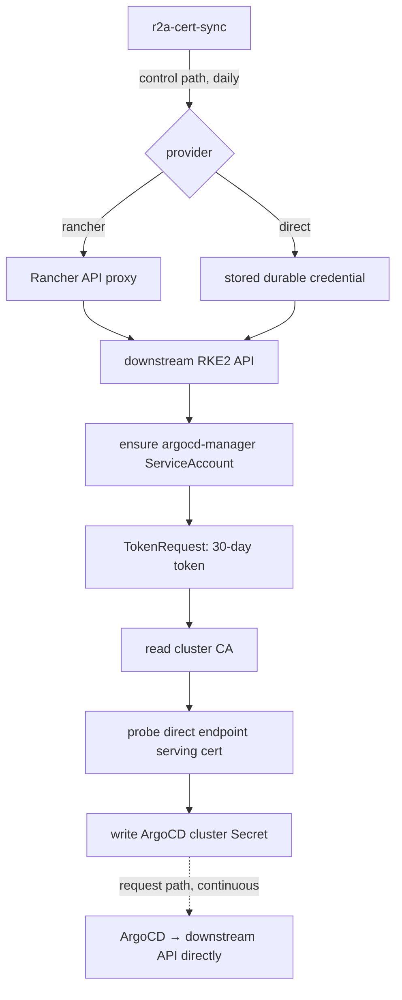

# r2a-cert-sync

`r2a-cert-sync` (**R**KE**2**-**to**-**A**rgo **Cert**ificate **Sync**) keeps ArgoCD's registrations for downstream
RKE2 clusters valid, so ArgoCD can connect to each cluster's API server directly instead of through the Rancher proxy.

It removes the Rancher management plane from the GitOps request path, and it removes the annual certificate expiry
that direct access would otherwise introduce.

## Why this is needed

Connecting ArgoCD to managed clusters through the Rancher proxy makes the management plane a hard dependency of
delivery. If Rancher is down, or its own certificates expire, ArgoCD loses access to every managed workload at once.

Pointing ArgoCD at downstream API servers directly fixes that, but the obvious way to do it — copying the admin client
certificate out of `/etc/rancher/rke2/rke2.yaml` into ArgoCD's cluster Secret — creates a new problem. That
certificate is valid for one year. When it expires, every ArgoCD Application on that cluster stops syncing, and the
fix is manual.

`r2a-cert-sync` solves this by not using client certificates at all. It keeps each cluster registered with a
short-lived ServiceAccount token that it mints and rotates itself.

## How it works

Two things happen on the control path and the request path, and keeping them apart is the whole design:

- **Control path** — the daemon reaches each downstream cluster to provision identities and mint credentials. For
  Rancher-managed clusters that goes through the Rancher API proxy. It runs once a day.
- **Request path** — ArgoCD connects straight to the cluster's own endpoint with the credential the daemon published.
  Rancher is not involved.

If Rancher is unavailable, reconciliation pauses and retries; ArgoCD keeps working. With the default 30-day token
lifetime refreshed daily, Rancher can be down for weeks before anything degrades.



Per cluster, each pass:

1. Obtains administrative access — through Rancher, or with the credential the daemon holds for standalone clusters.
2. Ensures the `argocd-manager` ServiceAccount and its `cluster-admin` binding exist, creating them if absent. This is
   the same identity `argocd cluster add` installs.
3. Mints a bound token via the TokenRequest API, honouring whatever lifetime the API server grants.
4. Reads the cluster CA from the `kube-root-ca.crt` ConfigMap.
5. Probes the direct endpoint's TLS certificate, verifying it against that CA and checking the SANs cover the
   configured address.
6. Writes the ArgoCD cluster Secret. ArgoCD re-reads cluster Secrets on every reconcile, so credentials swap with no
   restart of any ArgoCD component.

A credential is only reissued once it is past half its lifetime, or when something has drifted — so routine passes
write nothing and do not churn ArgoCD's cluster cache.

### Certificate rotation

RKE2 exposes no remote API for certificate rotation. It rotates certificates automatically on service restart when
they are within 90 days of expiry, and offers the node-local `rke2 certificate rotate` command. Neither can be invoked
remotely, so Rancher's `rotateCertificates` action is the only API-driven path.

The daemon therefore always **monitors** the serving certificate at each direct endpoint and warns as expiry
approaches. It will **trigger** rotation only for Rancher-managed clusters with `autoRotate: true`, because rotation
restarts downstream control-plane components. For standalone clusters the remedy is a `rke2-server` restart, which the
daemon reports but cannot perform.

Rotation waits for the cluster to leave the Active state before waiting for it to return. Watching only for "Active"
would match immediately and report success on a rotation that never started.

The cluster CA is deliberately never rotated: that would invalidate every kubeconfig and every ArgoCD `caData` at once.

## Prerequisites

- ArgoCD, and this daemon, running on a cluster that can reach each downstream API server directly.
- For Rancher-managed clusters: a Rancher API token whose user holds cluster-owner rights on those clusters (and
  permission to rotate certificates, if `autoRotate` is used anywhere).
- For standalone clusters: one-time bootstrap access, see below.

**Check your `tls-san` first.** An RKE2 API server's serving certificate only covers its node addresses, `127.0.0.1`,
`localhost`, the in-cluster names, and whatever is listed under `tls-san` in `/etc/rancher/rke2/config.yaml`. If the
endpoint you point ArgoCD at is a VIP, load balancer or FQDN that is not in `tls-san`, TLS verification will fail no
matter which credential is used — and `rke2.yaml` will not reveal this, because it connects to `127.0.0.1`.

The daemon checks this explicitly and refuses to publish a registration ArgoCD could never use, reporting the
certificate's actual SANs. Add the missing name to `tls-san` and restart `rke2-server`.

## Deployment

### Helm (recommended)

```bash
helm install r2a-cert-sync ./charts/r2a-cert-sync \
  --namespace r2a-cert-sync --create-namespace \
  --set rancher.url=https://rancher.example.com \
  --set 'clusters[0].name=downstream-1' \
  --set 'clusters[0].endpoint=10.0.0.10'
```

The Rancher token Secret is not managed by the chart — provide it via `kubectl`, Sealed Secrets, External Secrets
Operator or anything else:

```bash
kubectl create secret generic rancher-credentials \
  --namespace r2a-cert-sync \
  --from-literal=token=<rancher-api-token>
```

#### Key chart values

| Value | Default | Description |
| --- | --- | --- |
| `image.repository` | `ghcr.io/krisiasty/r2a-cert-sync` | Image repository |
| `image.tag` | Chart `appVersion` | Image tag |
| `rancher.url` | _(unset)_ | Rancher API URL; required if any cluster uses `provider: rancher` |
| `rancher.tokenSecret.name` | `rancher-credentials` | Secret holding the Rancher token |
| `rancher.caSecret.name` | _(unset)_ | Optional PEM bundle for a privately-signed Rancher endpoint |
| `defaults.tokenTTL` | `720h` (30d) | Requested lifetime of ArgoCD's credential, reissued at half life |
| `defaults.refreshInterval` | `24h` | Upper bound on the reconciliation period |
| `defaults.expiryWarnThreshold` | `2160h` (90d) | Warn below this much serving-certificate lifetime |
| `defaults.rotateThreshold` | `720h` (30d) | Rotate below this, where `autoRotate` is enabled |
| `defaults.secretNamespace` | `argocd` | Where generated cluster Secrets are written |
| `clusters` | `[]` | Cluster inventory, see below |
| `health.port` | `8080` | Port for `/livez`, `/readyz` and `/status` |

#### ArgoCD

Use `deploy/argocd-application.yaml` as a starting point:

```bash
kubectl apply -f deploy/argocd-application.yaml
```

### Plain manifests

```bash
kubectl apply -f deploy/rbac.yaml       # Namespace, ServiceAccount, Roles, RoleBindings
kubectl apply -f deploy/configmap.yaml  # cluster inventory — edit this first
kubectl apply -f deploy/deployment.yaml
```

Edit the `resourceNames` in `deploy/rbac.yaml` to match the `secretName` values you configure. The Helm chart derives
these automatically.

## Configuration

The daemon takes process settings from the environment and its cluster inventory from a YAML file, normally projected
from a ConfigMap. Adding or removing a cluster is a ConfigMap edit — no code change, and no chart upgrade unless a new
target namespace is introduced.

| Variable | Required | Default | Description |
| --- | --- | --- | --- |
| `POD_NAMESPACE` | yes | | Namespace the daemon runs in; all referenced Secrets live here |
| `CONFIG_PATH` | no | `/etc/r2a-cert-sync/config.yaml` | Path to the cluster inventory |
| `HEALTH_PORT` | no | `8080` | Port for `/livez`, `/readyz` and `/status` |

### Cluster inventory

```yaml
rancher:
  url: https://rancher.example.com
  tokenSecret:
    name: rancher-credentials
    key: token
  # caSecret: {name: rancher-ca, key: ca.crt}
  # insecureSkipTLSVerify: false

defaults:
  tokenTTL: 720h                # 30d, credential the daemon issues
  refreshInterval: 24h
  expiryWarnThreshold: 2160h    # 90d, downstream serving certificate
  rotateThreshold: 720h         # 30d, downstream serving certificate
  secretNamespace: argocd
  serviceAccount:
    name: argocd-manager
    namespace: kube-system

clusters:
  - name: downstream-1
    provider: rancher          # default
    endpoint: 10.0.0.10        # :6443 assumed
    secretName: cluster-downstream-1   # default: cluster-<name>
    secretNamespace: argocd
    autoRotate: false

  - name: standalone-1
    provider: direct
    endpoint: rke2.example.com:6443
```

Per-cluster fields: `name`, `provider`, `endpoint`, `displayName`, `rancherClusterName`, `secretName`,
`secretNamespace`, `project`, `bootstrapSecret`, `serviceAccount`, `agentServiceAccountName`, `tokenTTL`,
`expiryWarnThreshold`, `autoRotate`, `rotateThreshold`, `labels`, `annotations`. Unknown fields are rejected, so
typos fail at startup rather than being silently ignored.

Configuration is validated up front: duplicate cluster names, two clusters targeting one Secret, `autoRotate` on a
standalone cluster, a Rancher-provider cluster with no Rancher section, and malformed endpoints are all startup
errors.

## Providers

### `rancher` — no bootstrap required

Rancher's cluster agent is already privileged in every cluster Rancher manages. The daemon uses the Rancher API proxy
as its bootstrap authority, so onboarding a cluster is purely declarative: add it to the ConfigMap and it is
registered on the next pass. Nobody needs to touch the downstream cluster.

### `direct` — one-time bootstrap per cluster

Standalone RKE2 has no equivalent pre-privileged agent, so the first foothold has to come from somewhere. Bootstrap it
once with the same binary, from a workstation that already has a working kubeconfig for both clusters:

```bash
r2a-cert-sync bootstrap \
  --cluster standalone-1 \
  --endpoint 10.1.0.10 \
  --context standalone-1
```

This installs two identities downstream — `argocd-manager` with `cluster-admin`, and a narrowly-scoped
`r2a-cert-sync` identity for the daemon — then stores a durable credential for the latter in the daemon's namespace.
Nothing sensitive passes through your shell, and nothing lands in git. Use `--dry-run` first to see what it would do.

After that the cluster needs no `bootstrapSecret` at all, and the annual client-certificate expiry is gone: the daemon
maintains the registration from then on.

If you would rather not run the CLI, set `bootstrapSecret` to a Secret holding a kubeconfig (key `kubeconfig`) or a
bearer token (key `token`, optionally with `ca.crt`). The daemon will use it once on first contact, provision its own
credential, and then no longer need it — so a short-lived token works well:

```bash
kubectl -n kube-system create serviceaccount r2a-bootstrap
kubectl create clusterrolebinding r2a-bootstrap \
  --clusterrole=cluster-admin --serviceaccount=kube-system:r2a-bootstrap
kubectl -n kube-system create token r2a-bootstrap --duration=1h
```

A kubeconfig copied from `/etc/rancher/rke2/rke2.yaml` needs its `server` rewritten from `127.0.0.1` to the reachable
endpoint.

## Health and observability

| Endpoint | Purpose |
| --- | --- |
| `/livez` | Liveness — fails if the reconciliation loop has stalled |
| `/readyz` | Readiness — passes once every configured cluster has reconciled |
| `/status` | JSON detail per cluster, including observed certificate expiry. Carries no credential material |

Generated cluster Secrets also carry annotations you can read with `kubectl`:

```bash
kubectl -n argocd get secret cluster-downstream-1 \
  -o jsonpath='{.metadata.annotations}' | jq
```

`r2a-cert-sync.io/token-expires-at`, `r2a-cert-sync.io/serving-cert-expires-at`, `r2a-cert-sync.io/last-sync` and
`r2a-cert-sync.io/cluster`.

Logs are JSON via `log/slog`. Credential material is never logged.

## Security notes

The daemon holds no cluster-scoped permissions on the cluster it runs in. It gets one Role in its own namespace, and
one Role per target namespace restricted with `resourceNames` to the Secrets it generates — so it cannot read
ArgoCD's own Secrets. Kubernetes RBAC forbids combining `resourceNames` with `create`, so `create` on secrets is
namespace-scoped rather than name-scoped.

Downstream, the `r2a-cert-sync` identity used for standalone clusters is granted only what it needs: get/create
ServiceAccounts, create ServiceAccount tokens, get/create ClusterRoleBindings, and read the `kube-root-ca.crt`
ConfigMap. It holds no direct access to Secrets.

Be clear-eyed about what that does and does not buy. The right to mint a token for a `cluster-admin` ServiceAccount is
equivalent to `cluster-admin` by one hop — the narrow grant is for auditability and to avoid blanket Secret access,
not because the identity is unprivileged. What the design genuinely achieves is a **bounded leak window for the
credential ArgoCD holds**: the ArgoCD namespace is the broadly-exposed one, and a 30-day rotating token there is worth
considerably more than a non-expiring `cluster-admin` JWT that stays valid forever once leaked.

An existing `ClusterRoleBinding` that points at a different role, or omits the expected ServiceAccount, is reported as
an error rather than silently rewritten — an unannounced privilege change is not something a daemon should make.

## Building

```bash
# Local image build
docker build -t r2a-cert-sync:latest .

# Tests and linting
go test ./...
golangci-lint run
helm lint charts/r2a-cert-sync

# Release build (triggered automatically on version tag push)
git tag v0.1.0
git push origin v0.1.0
```

Releases are published to `ghcr.io/krisiasty/r2a-cert-sync` via GitHub Actions using GoReleaser. Multi-arch images
(`linux/amd64`, `linux/arm64`) are built and published as a combined manifest, alongside `linux` and `darwin`
archives for running the `bootstrap` subcommand from a workstation.

## Limitations

- Rotation is Rancher-only. Standalone RKE2 clusters are monitored and reported, not rotated.
- One replica, `Recreate` strategy. Two instances reconciling the same clusters would race to publish credentials.
- The CA bundle is never rotated. Rotating a cluster CA is a deliberate, disruptive operation and out of scope.
- Token lifetime is capped by the downstream API server's `--service-account-max-token-expiration`. The daemon logs a
  warning when it is granted materially less than it requested.
