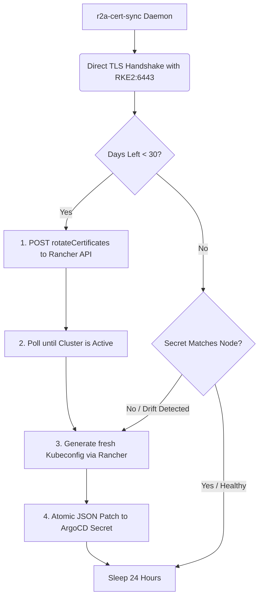

# r2a-cert-sync

`r2a-cert-sync` (**R**KE**2**-**to**-**A**rgo **Cert**ificate **Sync**) is a lightweight, cloud-native Go daemon designed to automate the lifecycle of X.509 certificates between downstream RKE2 clusters and ArgoCD. 

It ensures high availability for GitOps delivery pipelines by completely bypassing the Rancher API Server proxy for cluster connections, mitigating single-point-of-failure (SPOF) risks if the management plane experiences downtime.

## Why is this needed?

Connecting ArgoCD to managed clusters via the Rancher proxy creates a hard infrastructure bottleneck. If Rancher goes down or its own control-plane certificates expire, ArgoCD loses access to all managed workloads. 

Connecting ArgoCD directly to downstream IPs solves this, but introduces a new problem: RKE2 certificates expire annually. When they rotate, the direct-access administrative client keys change, instantly breaking the ArgoCD integration.

`r2a-cert-sync` solves this by running as a continuous background reconciliation engine.

## How It Works

The engine operates on a continuous, self-healing loop:

## Key Features

* **Continuous Reconciliation**: Runs as a persistent Kubernetes `Deployment` daemon rather than a `CronJob`.
* **Zero-Downtime Hot Reloading**: Exploits ArgoCD's dynamic secret-watching system; cluster credentials swap seamlessly without restarting ArgoCD pods.
* **Resilient Fail-Safe Error Handling**: Implements exponential backoff loops to gracefully survive transient API dropouts and network partitions.
* **Atomic Mutations**: Modifies integration configuration objects using native Kubernetes JSON Patches to eliminate concurrency race conditions.
* **Ultra-Lightweight & Secure**: Compiles into a statically-linked Go binary running in a minimal alpine image with zero external runtime dependencies.
