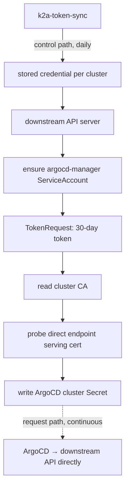

# k2a-token-sync

`k2a-token-sync` — Kubernetes to ArgoCD, token sync — keeps ArgoCD's registrations for downstream
Kubernetes clusters valid, using short-lived ServiceAccount tokens it mints and rotates itself.

It replaces the permanent, non-expiring credential `argocd cluster add` leaves behind, without changing anything about
how ArgoCD connects.

## Why this is needed

Registering a cluster with ArgoCD means putting a credential for it in a Secret, and ArgoCD has no way to renew one. So
the credential has to be long-lived: a ServiceAccount token that never expires, or a client certificate that lasts a
year and then breaks every Application on that cluster at once.

A permanent cluster-admin token sitting at rest is also the pattern Kubernetes itself is retiring — the TokenRequest API
is the endorsed mechanism, auto-generated ServiceAccount token Secrets were removed in 1.24, and recent releases track
last-use on legacy tokens and clean up unused ones. And a credential with no expiry satisfies no rotation policy: it
cannot even be revoked selectively, since deleting the ServiceAccount is the only lever.

`k2a-token-sync` keeps each cluster registered with a **short-lived** ServiceAccount token that it mints and rotates
itself, from outside ArgoCD. Nothing about ArgoCD changes: it is the same `argocd-manager` identity and the same cluster
Secret format, so this replaces the credential half of `argocd cluster add` and leaves the rest alone.

## How it works

Two paths, and keeping them apart is the whole design:

- **Control path** — k2a-token-sync connects to each downstream cluster with its own narrowly-scoped credential to mint
  ArgoCD's token. It runs once a day.
- **Request path** — ArgoCD connects straight to the cluster's own endpoint with the credential k2a-token-sync published.

If k2a-token-sync is down, reconciliation pauses; ArgoCD keeps working. With the default 30-day token lifetime
reissued at half life, k2a-token-sync can be down for a fortnight before anything degrades.



Per cluster, each pass:

1. Connects with the credential provisioned for that cluster at bootstrap.
2. Ensures the `argocd-manager` ServiceAccount and its `cluster-admin` binding exist, creating them if absent. This is
   the same identity `argocd cluster add` installs.
3. Mints a bound token via the TokenRequest API, honouring whatever lifetime the API server grants.
4. Reads the cluster CA from the `kube-root-ca.crt` ConfigMap.
5. Probes the direct endpoint's TLS certificate, verifying it against that CA and checking the SANs cover the
   configured address.
6. Writes the ArgoCD cluster Secret. ArgoCD re-reads cluster Secrets on every reconcile, so credentials swap with no
   restart of any ArgoCD component.

A credential is only reissued once it is past half its lifetime, or when something has drifted — so routine passes
write nothing and do not churn ArgoCD's cluster cache.

### Certificate expiry

k2a-token-sync uses bearer tokens, so no client certificate expires. But the API server's **serving** certificate still
matters: once it expires, or if it never covered the endpoint, ArgoCD's TLS handshake fails no matter how fresh the
token is.

So k2a-token-sync **observes** it — probing the endpoint each pass, verifying the presented chain against the CA it
publishes as ArgoCD's `caData`, and reporting expiry in `/status` and in its logs. It warns from 90 days out by default.

It never rotates anything. Reissuing a serving certificate needs node access and restarts control-plane components, so
it belongs to whatever manages the cluster — worth automating with your existing configuration management, one
control-plane node at a time. The cluster CA is deliberately out of scope too: rotating it would invalidate every
kubeconfig and every ArgoCD `caData` at once.

## Credentials

Two credentials exist per cluster, and they are not interchangeable.

| | ArgoCD's credential | k2a-token-sync's credential |
| --- | --- | --- |
| Identity | `argocd-manager` in `kube-system` | `k2a-token-sync`, same namespace |
| Permissions | `cluster-admin` — ArgoCD applies arbitrary manifests | four rules, see below |
| Form | bound token (TokenRequest) | bound token (TokenRequest) |
| Lifetime | `tokenTTL`, default 720h (30d) | `selfTokenTTL`, default 2160h (90d) |
| Renewed | by k2a-token-sync at half life, ~15d | by k2a-token-sync every pass, ~daily |
| Stored in | `cluster-<name>` in ArgoCD's namespace | `<name>-credentials` in k2a-token-sync's namespace |
| Used by | ArgoCD, connecting straight to the endpoint | k2a-token-sync, to mint the other one |
| Created by | k2a-token-sync | bootstrap |
| On expiry | k2a-token-sync mints another | k2a-token-sync is locked out; bootstrap again |

**Why two.** k2a-token-sync never needs `cluster-admin`. Its own identity holds four rules: get and create ServiceAccounts,
create `serviceaccounts/token`, get and create ClusterRoleBindings, and get exactly one ConfigMap — `kube-root-ca.crt`.
That is enough to maintain ArgoCD's identity and read the cluster CA, and nothing else.

Reusing ArgoCD's token for both would be simpler and worse. k2a-token-sync would hold `cluster-admin` on every cluster
permanently, and it would not even remove the permanence: a credential you can always renew *is* a permanent credential,
with extra steps. What would change is only the blast radius, in the wrong direction.

**Lifecycle.** Bootstrap creates both identities and mints the first token for its own. From then on k2a-token-sync
mints ArgoCD's tokens and renews its own, verifying each replacement against the cluster before storing it —
overwriting a working credential with a broken one would lock it out, and that is the one failure self-renewal could
introduce.

**The downtime budget.** `selfTokenTTL` measured from the *last successful pass*, so about 90 days by default. Nothing
else breaks meanwhile: ArgoCD's own token stays valid until its own expiry. Past that, bootstrap the cluster again — the
`kubectl get ccon` output will say `CredentialExpired` rather than reporting a bare 401.

**Revocation.** `TokenRequest` tokens cannot be revoked individually. Deleting the ServiceAccount invalidates all of its
tokens, which is the only lever, and for its own identity implies bootstrapping again.

**One nuance worth knowing.** RBAC's escalation check means its own identity cannot create the `argocd-manager`
cluster-admin binding: creating a binding requires holding the role's permissions or `bind` on it, and it has neither. In
steady state the binding already exists and is only read, so this never comes up. If someone deletes it, reconciliation
fails with *"attempting to grant RBAC permissions not currently held"* until bootstrap is re-run. That is the escalation
check working exactly as intended, and a confusing error to meet cold.

## Prerequisites

- ArgoCD, and k2a-token-sync, running on a cluster that can reach each downstream API server directly.
- One-time bootstrap access per cluster, see [Bootstrap](#bootstrap).

**Check the API server's certificate SANs first.** A serving certificate normally covers the node's own addresses,
`127.0.0.1`, `localhost` and the in-cluster names — but not a VIP, load balancer or FQDN unless that name was included
when the certificate was issued. If the endpoint you point ArgoCD at is missing from the SANs, TLS verification fails no
matter which credential is used, and a kubeconfig taken from a control-plane node will not reveal it, because that
connects to `127.0.0.1`.

k2a-token-sync checks this explicitly and refuses to publish a registration ArgoCD could never use, reporting the
certificate's actual SANs. Add the missing name to the API server's serving certificate — how depends on your
distribution — and restart or reissue it.

## Deployment

### Helm

The chart installs k2a-token-sync, its RBAC and the ClusterConnection CRD. It does not
manage cluster objects — those are separate manifests, see
[Adding a cluster](#adding-a-cluster).

```bash
helm install k2a-token-sync ./charts/k2a-token-sync \
  --namespace k2a-token-sync --create-namespace \
  --set image.tag=v0.0.1
```

#### Key chart values

| Value | Default | Description |
| --- | --- | --- |
| `image.repository` | `ghcr.io/krisiasty/k2a-token-sync` | Image repository |
| `image.tag` | **required** | Released version to deploy, e.g. `v0.0.1`. Rendering fails if unset |
| `argocdNamespace` | `argocd` | Namespace of the ArgoCD instance served; all cluster Secrets go here |
| `health.port` | `8080` | Port for `/livez`, `/readyz` and `/status` |

There is nothing here about clusters, and that is the point: the inventory lives in the API, so adding one needs no
release upgrade.

#### Upgrading the CRD

Helm installs `crds/` but never upgrades it. When a release changes the schema, apply it explicitly:

```bash
kubectl apply -f charts/k2a-token-sync/crds/
```

#### ArgoCD

Note the bootstrap ordering: ArgoCD manages k2a-token-sync on the local cluster, and k2a-token-sync in turn maintains ArgoCD's
registrations for every downstream cluster.

```yaml
apiVersion: argoproj.io/v1alpha1
kind: Application
metadata:
  name: k2a-token-sync
  namespace: argocd
spec:
  project: default
  source:
    repoURL: https://github.com/krisiasty/k2a-token-sync
    targetRevision: HEAD
    path: charts/k2a-token-sync
    helm:
      values: |
        image:
          tag: "v0.0.1"      # required; the release to deploy
  destination:
    server: https://kubernetes.default.svc
    namespace: k2a-token-sync
  syncPolicy:
    automated:
      prune: true
      selfHeal: true
    syncOptions:
      - CreateNamespace=true
```

A second Application can own the ClusterConnection objects if you want the fleet declared in git — optional, and
discussed under [Deployment paths](#deployment-paths).

### Without Helm

There is no second set of hand-maintained manifests, deliberately: a parallel copy would have to reproduce the RBAC and
the generated CRD by hand, and would drift. Render the chart instead, and apply or commit the output:

```bash
helm template k2a-token-sync ./charts/k2a-token-sync \
  --namespace k2a-token-sync --set image.tag=v0.0.1 --include-crds > k2a-token-sync.yaml
```

## Configuration

k2a-token-sync takes three settings from the environment. Everything else about a cluster lives in its ClusterConnection.

| Variable | Required | Default | Description |
| --- | --- | --- | --- |
| `POD_NAMESPACE` | yes | | Namespace k2a-token-sync runs in; its inventory and credentials live here |
| `ARGOCD_NAMESPACE` | no | `argocd` | Namespace of the ArgoCD instance served |
| `HEALTH_PORT` | no | `8080` | Port for `/livez`, `/readyz` and `/status` |

One instance serves one ArgoCD, so `ARGOCD_NAMESPACE` is a process setting rather than a per-cluster one. Point a
second release at a second ArgoCD if you need that.

### The ClusterConnection

One object per cluster, in k2a-token-sync's namespace. The minimal form is a name and an endpoint; everything else has a
default from the CRD schema, so `kubectl explain clusterconnection.spec` is the authoritative field reference.

```yaml
apiVersion: k2a-token-sync.io/v1alpha1
kind: ClusterConnection
metadata:
  name: standalone-1
  namespace: k2a-token-sync
spec:
  endpoint: 10.1.0.10          # :6443 assumed
```

[`examples/cluster-connection.yaml`](examples/cluster-connection.yaml) spells out every field, and the test suite parses
it so it cannot drift from the API.

Two things a schema cannot check are checked by k2a-token-sync and reported on the object: a name long enough to make the
Secret names derived from it invalid, and two connections claiming one `secretName` — which would have them silently
overwrite each other.

### Adding a cluster

```bash
k2a-token-sync bootstrap --cluster standalone-1 --endpoint 10.1.0.10 \
  --from-kubeconfig ./standalone-1.kubeconfig
```

That is the whole thing. Bootstrap prepares the downstream cluster, stores the credential, and applies the
ClusterConnection; k2a-token-sync publishes ArgoCD's credential within one poll, roughly 30 seconds. No release upgrade,
no restart, and no RBAC change — the chart's Role does not name individual Secrets, so nothing about it depends on how
many clusters exist.

It is safe to re-run. Every step is idempotent, including the object, which is written with server-side apply.

If you keep the ClusterConnections in git instead, see [Keeping the objects in
git](#keeping-the-objects-in-git). Order never matters either way: an object applied before its credential exists reports
`Ready=False` with reason `AwaitingCredential`, which makes `kubectl get ccon` a worklist of what is still outstanding.

Editing works the same way: `kubectl edit ccon standalone-1`, and the change takes effect within a poll. k2a-token-sync
compares the spec's generation against the one recorded in status, so an edit made while it was down is noticed too.

### Removing a cluster

```bash
kubectl delete ccon standalone-1
kubectl -n argocd delete secret cluster-standalone-1     # not done for you
```

Deleting the object stops maintenance. It deliberately does **not** delete the generated Secret: k2a-token-sync holds no
delete permission in ArgoCD's namespace, so removing a registration ArgoCD is actively using stays an explicit act. Left
alone, the credential in it expires within `tokenTTL`.

Two more objects outlive the connection, and can be removed once ArgoCD no longer needs the cluster: the
`argocd-manager` and `k2a-token-sync` ServiceAccounts downstream, along with their bindings.

With no `list` permission in ArgoCD's namespace, k2a-token-sync cannot detect a Secret left behind by a connection
that was removed while it was down. That is the cost of the RBAC posture below, and it is why cleanup is a documented
step rather than a promise.

## Bootstrap

k2a-token-sync has no way into a cluster until an identity exists for it there, and it deliberately never holds
administrative material of its own. Something therefore has to establish the first foothold, using a credential no
repository should contain — which makes bootstrap an imperative step by nature. `argocd cluster add` has the same seam;
the difference is what the act leaves behind.

```bash
k2a-token-sync bootstrap --cluster standalone-1 \
  --endpoint standalone-1.example.com:6443 \
  --from-kubeconfig ./standalone-1.kubeconfig
```

```text
Bootstrapping standalone-1

Downstream cluster — standalone-1
  reached via           https://standalone-1.example.com:6443
  ArgoCD endpoint       https://standalone-1.example.com:6443
  endpoint certificate  valid until 2027-07-31 (364 days left)
  identities            kube-system/argocd-manager, kube-system/k2a-token-sync
  verified              the new credential works against the endpoint

Cluster running ArgoCD — context gitops (https://gitops.example.com:6443)
  credential            k2a-token-sync/standalone-1-credentials, expires 2026-10-30
  registration          k2a-token-sync/standalone-1

Done. k2a-token-sync publishes ArgoCD's credential within 30 seconds:
  kubectl -n k2a-token-sync get ccon standalone-1
```

Output is grouped by cluster, because "where did that happen" is the first question when one command writes to two of
them. Registering the cluster ArgoCD itself runs on is a normal case, and the second heading then says "the same cluster
as above" rather than leaving you to compare two addresses.

In order: resolve both clusters before changing anything; read the cluster CA; **probe the endpoint** and refuse if its
certificate does not cover it; install the two identities; store the credential; use that credential once against the
endpoint to prove the whole path works; apply the ClusterConnection.

The pre-flight is there because a certificate that does not cover the endpoint is the most common reason direct access
fails, and it is far cheaper to learn before two identities exist than after. The verification is a warning rather than
an error — the endpoint may be reachable from the cluster k2a-token-sync runs on but not from your desk.

Downstream access is a **file**, not a context: files are what you can copy off a control-plane node.
`--from-kubeconfig` takes one, `--from-context` selects within it or within your ambient kubeconfig. Separate files are
supported on purpose, because merging kubeconfigs is unsafe when both define the same context name for different
clusters.

The credential never passes through your terminal — it goes from the downstream cluster into k2a-token-sync's namespace
directly. Progress goes to stderr, so `--print` can send the manifest to stdout without anything else in the way.

### Modes

| Mode | Prepares the cluster | Stores the credential | ClusterConnection |
| --- | --- | --- | --- |
| default | yes | yes | applied |
| `--print` | yes | yes | written to stdout, not applied |
| `--dry-run` | no | no | shown as a preview |

Every mode checks the endpoint first: that a certificate is served there, that it covers the address ArgoCD will use, and
that it verifies against the cluster's own CA. A missing SAN is the usual reason direct access fails, so `--dry-run` is
worth running against a new cluster before anything is created — it changes nothing and still answers that question,
along with when the certificate expires.

`k2a-token-sync bootstrap --help` lists the rest.

### Keeping the objects in git

`--print` provisions the cluster and stores the credential as usual, then writes the manifest to stdout instead of
applying it:

```bash
k2a-token-sync bootstrap --cluster standalone-1 \
  --endpoint standalone-1.example.com:6443 \
  --from-kubeconfig ./standalone-1.kubeconfig \
  --print > clusters/standalone-1.yaml
```

Commit that and let ArgoCD apply it, or apply it yourself. The value is review and audit — the object is spec-only, so a
repository is a reasonable home for it. Note that the declaration alone does nothing until the credential exists, which
bootstrap has already handled by the time the manifest is printed.

### Provisioning it yourself

The CLI is a convenience, not a requirement. Anything with administrative access can prepare a cluster by satisfying the
same contract:

- create the `argocd-manager` ServiceAccount and bind it to `cluster-admin`;
- create the `k2a-token-sync` ServiceAccount and bind it to a ClusterRole with the four rules above;
- mint a token for the second one;
- write `<name>-credentials` in k2a-token-sync's namespace with keys `token`, `ca.crt` and `expires-at`.

`expires-at` is RFC 3339 and may be omitted; the deadline is then treated as unknown and replaced with a known one at the
next renewal. That contract is worth implementing wherever your clusters are built, so a new cluster arrives ready and no
administrative credential ever moves.

### Never manage the credential Secrets declaratively

Do **not** create `<name>-credentials` with External Secrets, an ArgoCD Application, Sealed Secrets, or anything else that
reconciles toward a stored value. Those Secrets belong to k2a-token-sync, which rewrites each one on every pass — roughly
daily — to keep the remaining lifetime near the full `selfTokenTTL`.

A second writer turns that into a silent fault. Every renewal is undone on the next reconcile, so the credential stops
advancing; about ninety days later the stored copy expires and gets pushed over a working token, and k2a-token-sync locks
itself out of the cluster. The symptom appears a quarter after the cause.

There is also nothing to gain. The credential is disposable: it is regenerated in seconds by re-running bootstrap, and
k2a-token-sync replaces it daily regardless, so a vaulted copy is stale almost immediately. What deserves protecting is
the administrative kubeconfig bootstrap consumes — which you already manage somewhere.

## Deployment paths

Two shapes work, and they differ only in who applies the chart.

**Helm or Ansible, then bootstrap.** Install the chart, then run bootstrap once per cluster. Nothing per-cluster lives in
git; the inventory lives in the API, which is what moving it out of a ConfigMap was for.

**ArgoCD owns the chart, then bootstrap.** An Application deploys the chart from git — CRD, RBAC, Deployment, no secrets,
fully declarative. Bootstrap still runs out-of-band, because the credential cannot be in git.

So the part GitOps cannot express is exactly **one credential per cluster**, and the natural place to create it is
wherever administrative access already exists: the automation that builds the cluster. Implement the contract above in
that automation and there is no separate onboarding step at all.

If you also want the ClusterConnections in git, add a second Application for them and use `--print`. That is optional
rather than implied: an Application that renders only the chart never prunes bootstrap-created objects, because ArgoCD
prunes only what it tracks.

## Health and observability

| Endpoint | Purpose |
| --- | --- |
| `/livez` | Liveness — fails if the reconciliation loop has stalled |
| `/readyz` | Readiness — passes once every cluster in the inventory has reconciled |
| `/status` | JSON detail per cluster, including observed certificate expiry. Carries no credential material |

Per-cluster state is on the objects themselves, which is the readable view:

```console
$ kubectl -n k2a-token-sync get ccon
NAME           ENDPOINT                       READY   TOKEN EXPIRES   SELF EXPIRES   CERT DAYS   AGE
downstream-1   10.0.0.10:6443                 True    29d             89d             364         12d
standalone-1   cluster2.example.com:6443      True    22d             89d             211         12d
standalone-2   10.2.0.10:6443                 False   <none>          <none>          <none>      2m
```

`kubectl describe ccon standalone-2` then gives the reason — `AwaitingCredential` for one that has not been bootstrapped,
`CredentialExpired` for one whose own credential lapsed, `CertificateInvalid` for an endpoint whose certificate cannot
work.

Generated cluster Secrets also carry annotations you can read with `kubectl`:

```bash
kubectl -n argocd get secret cluster-downstream-1 \
  -o jsonpath='{.metadata.annotations}' | jq
```

`k2a-token-sync.io/token-expires-at`, `k2a-token-sync.io/serving-cert-expires-at`, `k2a-token-sync.io/last-sync` and
`k2a-token-sync.io/cluster`.

Logs are JSON via `log/slog`. Credential material is never logged.

## Security notes

k2a-token-sync holds no cluster-scoped permissions on the cluster it runs in. Its objects are namespaced and only its own
namespace is listed, so a Role suffices everywhere.

**In ArgoCD's namespace it holds `create` and `patch` on Secrets, and nothing else.** It cannot read — not the Secrets it
writes, and not ArgoCD's own. It learns the result of its own writes from what an apply returns, and keeps everything
else in each ClusterConnection's status.

Those two verbs are namespace-wide because they have to be: cluster names are not known when the Role is created, which
is the whole point of an inventory that changes at runtime, and RBAC cannot scope `resourceNames` by prefix. Be
clear-eyed about what that permits — `patch` on any Secret in that namespace means k2a-token-sync *could* overwrite ArgoCD's
repository credentials. Two things bound it. `secretName` must begin with `cluster-`, so no connection can be aimed at
them; and the absence of `delete` means nothing there can be removed.

The cost of that posture is stated under [Removing a cluster](#removing-a-cluster): with no `list`, k2a-token-sync cannot
notice an orphaned Secret.

Downstream, the `k2a-token-sync` identity is granted only what it needs: get/create ServiceAccounts, create ServiceAccount
tokens, get/create ClusterRoleBindings, and read the `kube-root-ca.crt` ConfigMap. It holds no access to Secrets at all.

Be equally clear-eyed there. The right to mint a token for a `cluster-admin` ServiceAccount is equivalent to
`cluster-admin` by one hop — the narrow grant is for auditability and to avoid blanket Secret access, not because the
identity is unprivileged. What the design genuinely achieves is that **no non-expiring credential exists anywhere in
the system**: ArgoCD's token lasts 30 days and k2a-token-sync's own 90, both renewed automatically. That bounds the
value of any leak, which a permanent `cluster-admin` JWT does not.

An existing `ClusterRoleBinding` that points at a different role, or omits the expected ServiceAccount, is reported as
an error rather than silently rewritten — an unannounced privilege change is not something this tool should make.

## Building

```bash
# Local image build
docker build -t k2a-token-sync:latest .

# Tests and linting
go test ./...
golangci-lint run

# image.tag is required, so the chart needs one to render — any value will do
# when you are only checking the templates
helm lint charts/k2a-token-sync --set image.tag=v0.0.1
```

Releases are published to `ghcr.io/krisiasty/k2a-token-sync` via GitHub Actions using GoReleaser. Multi-arch images
(`linux/amd64`, `linux/arm64`) are built and published as a combined manifest, alongside `linux` and `darwin`
archives for running the `bootstrap` subcommand from a workstation.

### Cutting a release

```bash
git tag v0.1.1
git push origin v0.1.1
```

That is the whole release. GoReleaser builds and publishes the images, archives and GitHub release. Then set
`image.tag` to the new version where you deploy — your values file, or the ArgoCD Application — and the upgrade
rolls out.

### Versioning

The chart and the application are versioned independently, which is what Helm's two fields are for:

- **Chart `version`** moves only when the chart changes: a new resource, a renamed or removed value, a changed default.
  Ship five application releases without touching the templates and it stays put.
- **The application version is `image.tag`**, supplied in deployment values. There is deliberately no `appVersion` in
  `Chart.yaml`.

That separation is load-bearing rather than cosmetic. If `image.tag` fell back to chart metadata, the deployed version
would live in a file inside the tagged tree — and since the tag is what triggers the build, the chart could never name
the image that release produced. Keeping it in deployment values means it is set after the release, and the version you
are running is stated explicitly instead of inferred. Rendering fails with an actionable message if it is missing, so
the requirement cannot be discovered as a mystery `ImagePullBackOff`.

## Limitations

- Serving certificates are observed, never rotated. Reissuing one needs node access, so it belongs to whatever manages
  the cluster.
- One replica, `Recreate` strategy. Two instances reconciling the same clusters would race to publish credentials.
- The CA bundle is never rotated. Rotating a cluster CA is a deliberate, disruptive operation and out of scope.
- Token lifetime is capped by the downstream API server's `--service-account-max-token-expiration`. k2a-token-sync
  logs a warning when it is granted materially less than it requested — which matters more for its own credential than
  for ArgoCD's, since that lifetime is the outage it can survive.
- k2a-token-sync cannot detect a generated Secret left behind by a cluster removed while it was down, because it holds no
  `list` permission in ArgoCD's namespace. Cleanup is a documented step.
- No metrics endpoint. `/status` and the objects' own status carry the same information for now.
